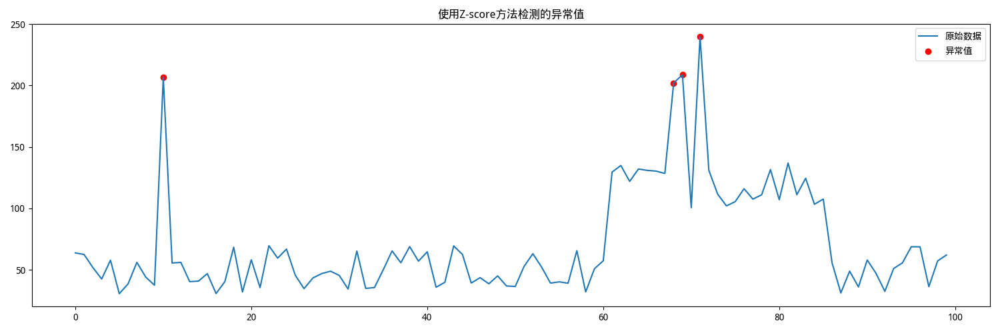

---
html:
  embed_local_images: true
  embed_svg: true
  offline: true
  toc: true
export_on_save:
  html: true
toc:
  depth_from: 1
  depth_to: 4
  ordered: false
---

# Z分数异常数据检测方法

Z 分数异常检测 是一种基于统计学的异常检测方法，通过计算数据点的 Z 分数（Z-score） 来判断其是否为异常值。Z 分数反映了数据点与数据集均值之间的偏离程度，以标准差为单位。

## 适用场景

- 数据近似服从正态分布（或至少是对称分布），例如：金融数据（如股票收益率）、考试成绩、生产质量数据（如产品尺寸、重量）
- 需要快速识别极端值的时候，例如：传感器数据中的异常值、网络流量中的异常行为、财务数据中的异常交易等
- 数据标准化需求，例如机器学习中的数据预处理、多指标综合评价（如学生成绩、员工绩效）
- 异常值定义明确的场景

## 计算公式

Z 分数的计算公式为：Z =（X−μ）/σ

其中：
- X：某个数据点的值
- μ：数据集的均值（平均值）
- σ：数据集的标准差

Z 分数的意义：
- Z=0：数据点等于均值
- Z>0：数据点高于均值
- Z<0：数据点低于均值

## 原理说明

- 如果某个数据点的 Z 分数绝对值较大（即远离均值），则该数据点可能是异常值
- 通常，设定一个阈值（如 Z=3 或 Z=2），如果数据点的 Z 分数绝对值超过该阈值，则认为它是异常值

## 阈值选择

- ∣Z∣ > 3：适用于严格检测，只有非常极端的数据点才会被标记为异常
- ∣Z∣ > 2：适用于一般检测，可能会标记更多的潜在异常值

## 示例数据说明

示例数据z-score.xlsx中，使用rand函数构造了一组随机数，并人为修改了其中几个让其z分数大于3来模拟异常情况；使用z-score.py执行z分数检测，得到结果，并在图片`zscore_anomalies.png`中标识异常位置。

## 代码说明

- pandas：数据分析和处理库，用于数据的导入和基本处理，例如数据清洗和预处理、数据重塑和透视、时间序列处理、数据合并和连接、统计分析、数据可视化等
    - read_csv()：读取CSV格式的数据文件
        - iloc[]：索引器，用于按位置进行整数索引
            - values[]：将pandas对象转换为NumPy数组
                - reshape()：重塑数组的形状
- numpy：数学和科学计算库，用于数值计算、数组和矩阵操作等
    - where()：条件判断，用于判断数组中的元素是否满足某个条件
- sklearn：机器学习库，用于数据预处理、模型训练和评估等
    - preprocessing：数据预处理，包括标准化、缩放等
        - StandardScaler：标准化数据，将特征缩放到标准化的分布（均值为0，标准差为1）
            - fit_transform()：拟合并转换数据
- matplotlib：数据可视化库，用于绘图、图表、图形和动画等
    - font_manager：字体管理，用于设置字体和字号等，解决中文问题
    - pyplot：绘图工具，用于生成静态图形和动态图形
        - figure：创建图形对象，用于绘制图形和图表
        - plot：绘制图形，用于绘制折线图、柱状图等
        - scatter：绘制散点图，用于显示数据点
        - title：设置图形标题
        - legend：设置图例
        - tight_layout：自动调整子图布局
        - savefig：保存图形，用于保存绘制的图形
        - close：关闭图形，用于关闭绘制的图形

## 输入和输出

```
python z-score.py
Z-score方法检测到 4 个异常值

详细的异常值信息：
索引: 10, 值: 206.71
索引: 68, 值: 202.08
索引: 69, 值: 208.72
索引: 71, 值: 239.86
```


